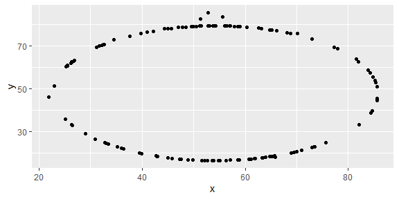

Lab 01 - Hello R
================
Casey Bales
February 3rd 2021

## Load packages and data

``` r
library(tidyverse) 
library(datasauRus)
```

## Exercises

### Exercise 1

datasaurus\_dozen %\>% count(dataset) %\>% print(13)

There are 1846 rows and 3 variables in the data frame. In the output
there are 13 rows and 2 columns and for each dataset there is an n of
142.

### Exercise 2

First let’s plot the data in the dino dataset:

``` r
dino_data <- datasaurus_dozen %>%
  filter(dataset == "dino")

ggplot(data = dino_data, mapping = aes(x = x, y = y)) +
  geom_point()
```

<!-- -->

And next calculate the correlation between `x` and `y` in this dataset:

``` r
dino_data %>%
  summarize(r = cor(x, y))
```

    ## # A tibble: 1 x 1
    ##         r
    ##     <dbl>
    ## 1 -0.0645

The correlation for the dino dataset is -0.0645.

### Exercise 3

``` r
star_data <- datasaurus_dozen %>%
  filter(dataset == "star")

ggplot(data = star_data, mapping = aes(x = x, y = y)) +
  geom_point()
```

<!-- -->

``` r
star_data %>%
  summarize(r = cor(x, y))
```

    ## # A tibble: 1 x 1
    ##         r
    ##     <dbl>
    ## 1 -0.0630

The correlation for the star dataset is -.0630. This correlation is less
than the correlation using the dino dataset.

### Exercise 4

``` r
circle_data <- datasaurus_dozen %>%
  filter(dataset == "circle")

ggplot(data = circle_data, mapping = aes(x = x, y = y)) +
  geom_point()
```

<!-- -->

``` r
circle_data %>%
  summarize(r = cor(x, y))
```

    ## # A tibble: 1 x 1
    ##         r
    ##     <dbl>
    ## 1 -0.0683

The correlation for the circle dataset is -.0683. The correlation is
greater than the correlation for the dino and star datasets.

### Exercise 5

Add code and narrative as needed. To add R chunks either type out the
backticks, curly braces, and the letter `r` or use the Insert chunk
button above, green C+.
